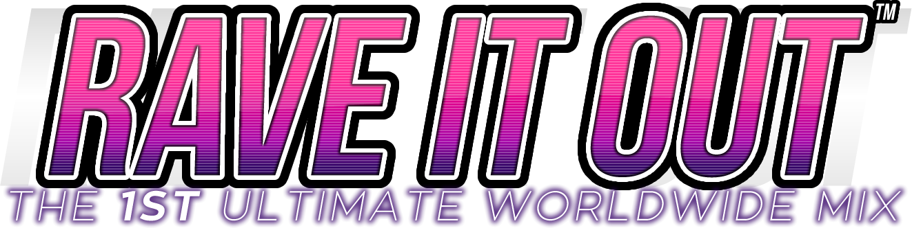

# Rave It Out: Revive

Rave it Out Revive Project!

## Usage
Works on 5.0.12+ only. Auto Velocity will not work if you do not compile the [latest 5.1-new branch](https://github.com/stepmania/stepmania/tree/5_1-new) of StepMania or [our fork](https://github.com/RhythmLunatic/stepmania/tree/starworlds).

Supports Dance and Pump mode, although the graphics will still be for pump. (May support other modes too, but you'll probably get some bugs)

## Configuration

Rewriting this.

## Adding new songs

Check Song Structure Documentation.txt.
